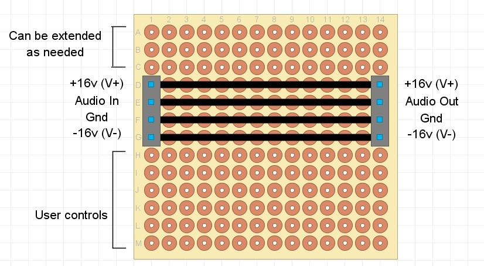

## The KISS Modular Audio Standard
This standard defines a simple set of rules that allow for compatibility with all other modules that follow this standard, including all the default modules in the KISS Modular Audio Project.

### Rules
Each module must follow the following standards for compatibility:
- a standard 0.1 inch grid (compatible with common electronics prototyping boards such as veroboard).
- 4 pin connectors: a 1x4 socket on the left for input, and a 1x4 pin header on the right for output (these are technically optional, but most modules will need at least one, and most likely both)
- The 4 pin connectors should be placed such that the bottom most pin is 0.7 inches from the bottom of the board (ie. 6 x 0.1 inch holes between the connector and the bottom of the board)
- The recommended 4 pin connectors are the SSW-104-02-G-S-RA (socket) and TSW-104-08-G-S-RA (pin) right-angle connectors from SamTec, although anything that is physically compatible with these connectors can be used.
- Any user controls should be placed at the bottom edge of the board, in the first 6 rows.
- the 4 pins are (from top to bottom): +16v, audio signal, ground, -16v
- the reference audio signal voltage is line level (nominal 0.775v at 0dbu), though the actual level will vary depending on the upstream signal levels and processing modules

### Minimal Board Layout
The minimal board would have the following characteristics:
- 6 rows of pads at the bottom (for components and controls)
- connectors on left and right, wired to connect source to sink +16v, Audio, Ground, -16v
- any number of pads above the connectors
- any width of board

### Example
The [attenuator](modules/attenuator/MODULE.md) reduces the level of the audio signal. 

This example shows the main characteristics of the module:
- 4 pin socket on left
- 4 pin header on right
- controls in bottom 6 rows
- connectivity between inputs and outputs

See [modules](modules/) for more detailed examples.