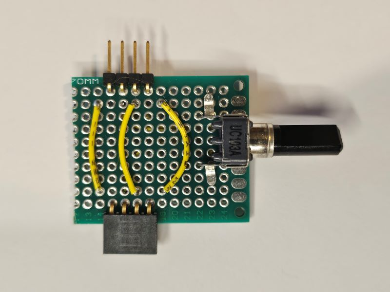

# KISS Modular Audio

## Introduction
Keep It Simple Stupid (KISS) Modular Audio is a guide for constructing a series of modular electronic boards for audio signal processing, aimed at DIY.

The goal for the project is to provide tools and guides to beginners looking to understand, work with and prototype audio electronics. It also includes [a basic standard](KISS_STANDARD.md) that allows the community to extend the project with additional compatible modules.

The project consists of a number of schematics that can be used to create modules that interconnect and do basic audio signal processing (such as amplification, distortion, saturation, EQ, compression). Each schematic comes with documentation that explains how the circuit works.

The aims of the project are:
- simple, with minimum number of components
- cheap, only requiring low-cost, readily available components
- modular, to allow the same circuits to be interconnected in different ways
- educational, to allow the user to understand the principles behind the circuit design and be able to adapt them

This project was originally inspired by the [DIYRE Colour format](https://www.diyrecordingequipment.com/collections/colour), but does not require the cost and overhead of 500 series boards and chassis.

## Getting Started
While the boards are modular, and some modules are passive (do not require a power supply), most useful circuits will require you to build the following minimal set of components:
- A +/-16V dual rail power supply with ground, supplying 250mA per rail or greater (not currently included in scope of project, but see below*)
- The Power Supply module 
- The Unbalanced Audio Jack Input module
- (Any number of audio processing modules)
- The Unbalanced Audio Jack Output module

The power supply module is always the left most module. The next module across is typically the audio input module. Other modules are then chained together, and the audio signal flows from left to right. The final module on the right is the audio output.

The modules slot together with simple pin connectors, so can easily assembled and dissassembled and added in any order. 

### Example chain
This example amplifies the audio signal and passes it through an audio transformer, which adds some 'warmth' with some natural harmonic frequencies, and then reduces the audio signal again, ready to pass back into the audio output. The modules (from left to right are):
- [Power Supply](modules/power-supply/MODULE.md)
- [Unbalanced Audio Jack Input](modules/unbalanced-line-audio-in/MODULE.md)
- [Op Amp](modules/op-amp/MODULE.md)
- [Audio Transformer 1:1](modules/transformer-1-1/MODULE.md)
- [Audio Attenuator](modules/attenuator/MODULE.md)
- [Unbalanced Audio Jack Output](modules/unbalanced-line-audio-out/MODULE.md)

## *Power Supplies
The modules require a +/-16V dual rail power supply with ground. There are lots of DIY options for this, though oddly very few off the shelf solutions. Quality of power supply will vary depending on cost. A cheap simple switching power supply would get you started, but a linear power supply will give better audio performance.

Some options:
- 24V/1A DC PSU e.g. https://www.amazon.co.uk/dp/B0D7QBHKLG + DC/DC step down module e.g. https://www.aliexpress.com/item/1005005557546986.html / https://www.amazon.co.uk/dp/B082FBXXG3 (recommended for beginners, as the mains components are sealed in the PSU, so you are only dealing with low level voltage)
- Linear Power Supply Board e.g. https://www.aliexpress.com/item/1005006216905481.html (note - this uses mains voltage, so do not use unless it is properly cased, earthed, protected by RCCB and you are experienced in safely working with mains voltages!)

## DIY
Schematics and example prototype board layouts are shared for each module. To assemble, you'll need to buy the electronic components and solder and wire together the modules. The prototype board layouts can be used as a construction guide: they are based on 'pad' boards which are prototype boards with individual pads on a 0.1 inch matrix with no copper traces. Yellow lines are used for top of board wiring, and black for wiring underneath the board (either bending and soldering component wires to connect components together, or soldering jumper wires underneath the boards).

The modules are primarily designed to work with consumer computer audio interfaces, and are compatible with any audio interface that has at least 1 channel line level output and 1 channel line level input.

A signal generator and oscilloscope are recommended to identify and fix any issues you have with the modules. You can also use the free [REW Room Acoustics Software](https://www.roomeqwizard.com/) which can perform signal generation and act as a simple oscilloscope using your audio interface.

## Licence
This project is licenced under the [Creative Commons Attribution-NonCommercial-ShareAlike 4.0 International](LICENCE.md) open source licence. This license requires that reusers give credit to the creator. It allows reusers to distribute, remix, adapt, and build upon the material in any medium or format, for noncommercial purposes only. If others modify or adapt the material, they must license the modified material under identical terms.