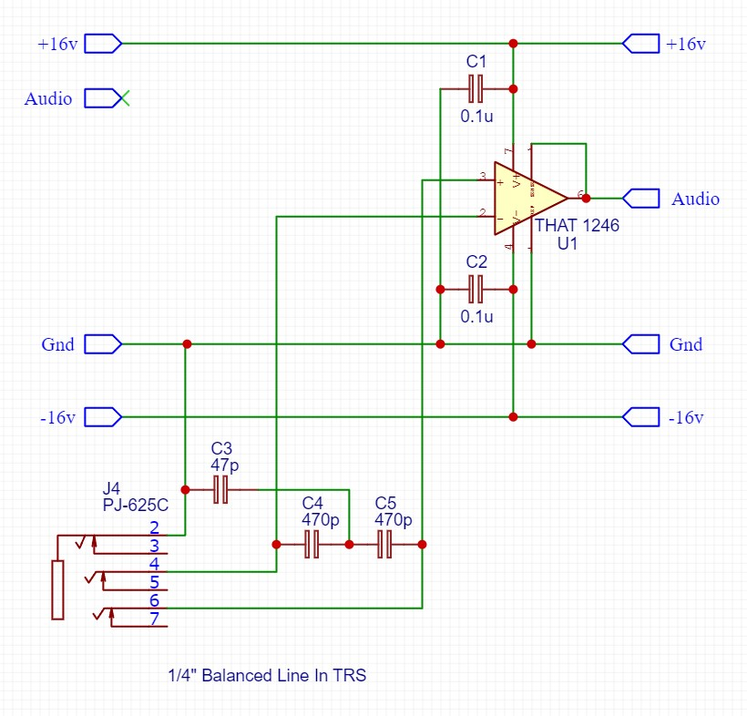
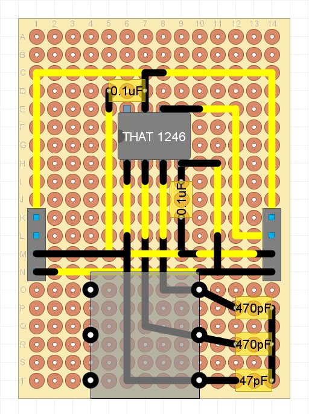

## Balanced Line Audio In Module

### Purpose
This module connects an external audio input (1/4 inch TRS balanced jack) into the module chain. It is optimised for a balanced 'line level' input of +6dbu = 1.55V, which it attenuates by -6db (half) to 0.775V for compatibility with other audio modules.

### Schematic

### Protoboard layout

### Design Notes
This module uses the THAT 1246 Balanced Line Reciever IC. The circuit is based off the THAT 1246 datasheet (Figure 4. with RFI and supply bypassing).
For more design details see the THAT 1246 datasheet. Note that the THAT 1246 is compatible with both +/-16v and 9v power supplies.

- Note that an XLR connector can be used instead of a TRS 1/4" jack. 
