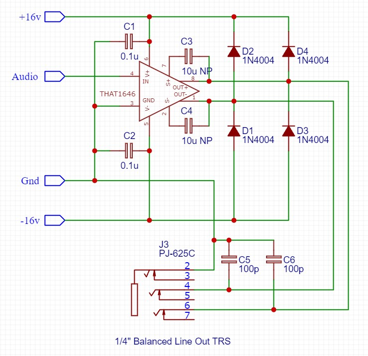
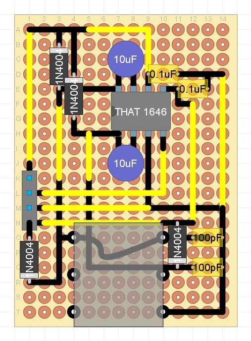

## Balanced Line Audio Out Module

### Purpose
This module connects the end of a module chain to an external audio output (1/4 inch TRS balanced jack). It is optimised for a balanced 'line level' output of +6dbu (ie. is configured to double the output voltage of the audio).

### Schematic

### Protoboard layout

### Design Notes
This module uses the THAT 1646 Balanced Line Driver IC. The circuit is based off the THAT 1646 datasheet (Figure 5. with common-mode offset reduction), with additional RFI and surge protection (Figure 8 applications circuit with output common-mode offset protection, RFI protection and surge protection).
For more design details see the THAT 1646 datasheet.

- Note that an XLR connector can be used instead of a TRS 1/4" jack. 
- D1-4 - The diodes protect against accidental +48v phantom power being applied via XLR, and can be ommitted if a jack connector is used, and there is no possibility of phantom power being applied.