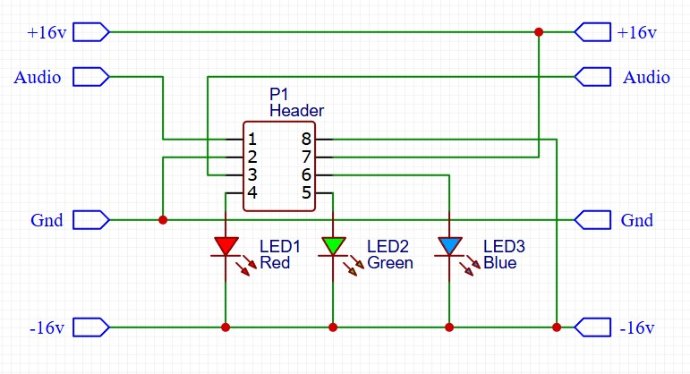
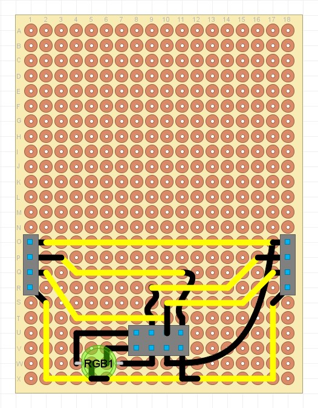

## Colour Module Adapter

### Purpose
This is a passive module that acts as an interface between KISS modules and the modules that are compatible with the [DIYRE Colour Format](https://www.diyrecordingequipment.com/pages/colour-designer-s-toolkit).

### Schematic

### Protoboard layout

### Design Notes
- P1 - this is a socket for the 8 pin colour module connector. Note that some additional physical support for the colour module is recommeded, so that when the colour module is placed onto the board it cant flex or bend the pins.