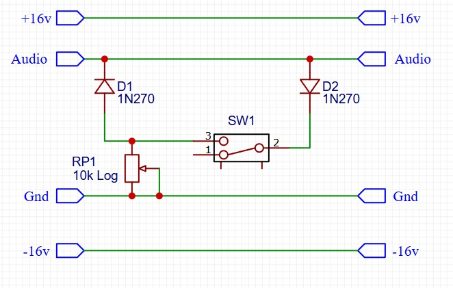
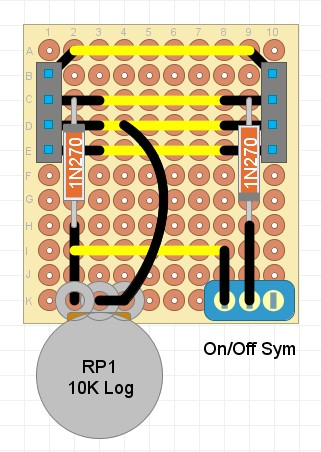

## Diode Clipper

### Purpose
This module uses diodes to distort the audio waveform. It is based on the [Mojo Maestro](https://audioxpress.com/article/you-can-diy-build-the-mojo-maestro) design by Ethan Winer.

### Schematic

### Protoboard layout

### Design Notes
- D1 / D2 - these two diodes connect to Ground, and will start conducting when the audio signal rises beyond a certain threshold (the forward voltage). This has the effect of restricting the range of the audio signal, by 'clipping' off the top or bottom. The 1N270 diode in the example has a Forward Voltage of 1v.
- SW1 - this switch selects whether both D1 and D2 are connected, or just D1. That allows the user to select between symmetric and asymmetric clipping.
- RP1 - this potentiometer adjusts the voltage differential over the diodes, increasing or decreasing the amount of clipping.