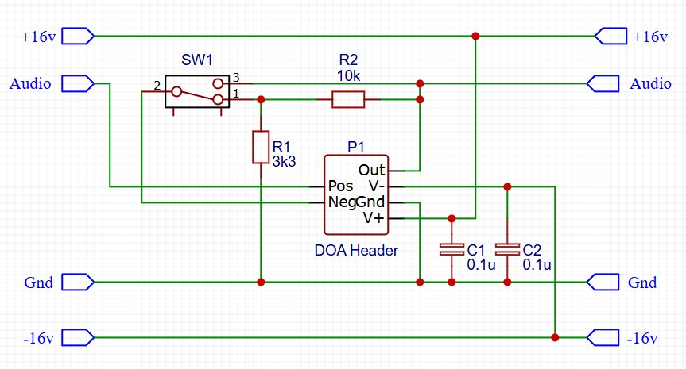
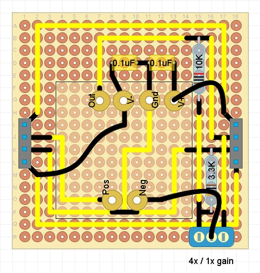

## Discrete Op Amp Adapter

### Purpose
This module allows you to interface API-2520 compatible Discrete Op Amps (DOAs). 

### Schematic

### Protoboard layout

### Design Notes
- DOA sockets - Use 1mm diameter PCB female sockets to connect the pins of the op amp board. These will be larger the the holes in protoboard, so you'll need to drill out the pad holes to an appropriate size, then push in the sockets (and glue in place if needed). Once in place, you can solder connections to the sockets as per any other component.
- SW1 - this switches between unity gain (ie. the output signal will be the same voltage as the input signal), and whatever gain you select via R1/R2.
- R1 / R2 - sets the fixed gain of the circuit. gain = 1 + (R2 / R1). The example values give a fixed gain of 4x.