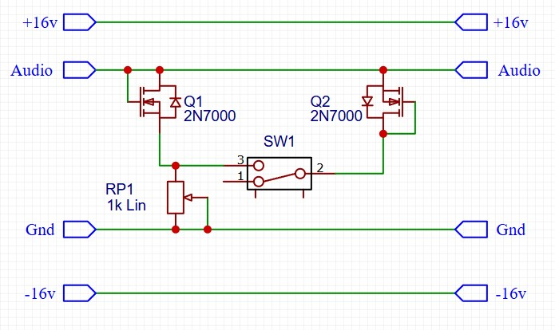
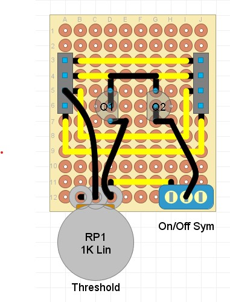

## FET Clipper

### Purpose
This module uses FETs to distort the audio waveform.

### Schematic

### Protoboard layout

### Design Notes
- Q1 / Q2 - these two FETs connect to Ground, and will start conducting when the audio signal rises beyond a certain threshold. This has the effect of restricting the range of the audio signal, by 'clipping' off the top or bottom. The 2N7000 FETs in the example have a Gate Threshold Voltage of 0.8v.
- SW1 - this switch selects whether both Q1 and Q2 are connected, or just Q1. That allows the user to select between symmetric and asymmetric clipping.
- RP1 - this potentiometer adjusts the voltage differential over the transistors, increasing or decreasing the amount of clipping.