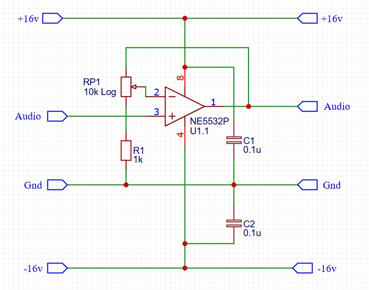
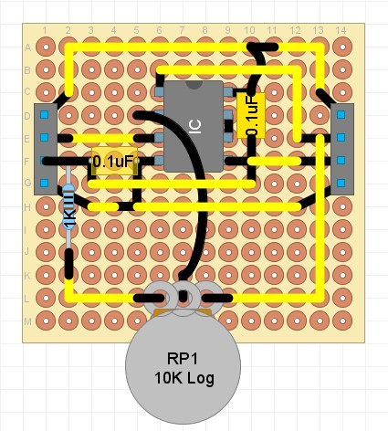

## Op Amp

### Purpose
This module uses an operational amplifier integrated circuit (e.g. NE5532) to amplify the audio signal.

### Schematic

### Protoboard layout

### Design Notes
- C1 / C2 - power supply decoupling capacitors, which should be placed as close to the op amp as possible to stabilise the power going into the op amp
- RP1 / R1 - feedback gain loop, with the circuit gain = 1 + (RP1 / R1). The example values give a variable gain between 1x and 11x.
- Op Amp - the NE5532P is used in the example, but any op amp with a compatible footprint could be used. Alternatively the protoboard layout could be modified to use a single op amp package (e.g. 741 series).