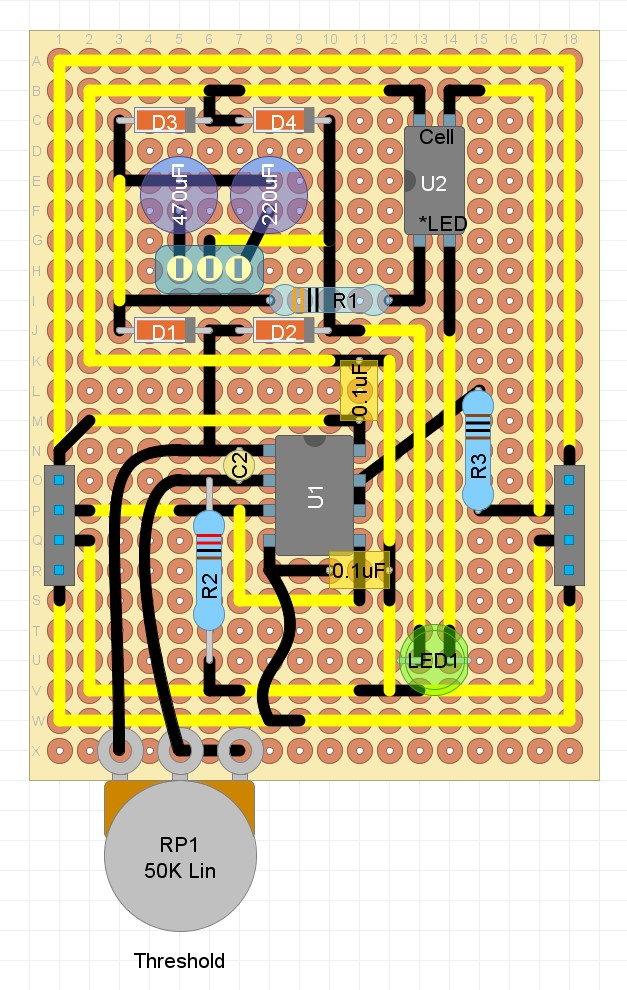

## Opto Compressor

### Purpose
This module uses an optocoupler (LED/photodiode) to compress the audio signal.

### Schematic

### Protoboard layout

### Design Notes
The incoming audio signal is split into two, with one connection driving the LED part of the octocoupler based on the average level of the signal (the detector), and the other connection driving the audio output, where the photodiode part of the octocoupler is used to reduce the voltage of the output signal by grounding the connection (the compressor).

The detector circuit uses an op amp, bridge retifier, and smoothing capacitor to generate a DC voltage that is dependent on the overal volume of the incoming audio signal:
- U1.1 is configured as a non-inverting amplifier, using RP1 and R2. Since the typical line level input voltage is around 0.77v RMS, the op amp is configured to saturate the output (around 15v) at maximum gain (ie. approx 20x). Gain = 1 + (RP1 / R2). 
- C4 / C5 decouple the op amp power supply to ground and are required to stabilise the op amp
- C3 (optional) helps improve the high frequency stability of the op amp
- D1-D4 work as a bridge rectifier, converting the signal to a positive voltage
- SW1 allows you to select different capacitor values (C1 or C2)
- C1 / C2  perform two functions. they smooth the rectified AC audio signal into a constant DC voltage, and they also take some time to charge and discharge. This affects the attack and release times of the compressor. You can experiment with different values, e.g. 470uF gives a fairly long attack and release time for a classic 'smooth' opto compressor sound. A smaller value like 220uF increases the attack and release for a more dynamic compression sound.
- LED1 indicates the amount of compression taking place
- U2 is the optocoupler. NSL 32 is used in this example. The NSL 32 has a forward voltage of 2v, and a nominal operating current of 20mA. With an input voltage of 15v, with LED1 in series, a resistor around 500 Ohm is required to limit the current.

The compressor circuit is a simple op amp buffer, with the output connected to ground via the NSL32 photo diode. As the detector increases voltage, the photodiode increases conductivity, attenuating the output signal