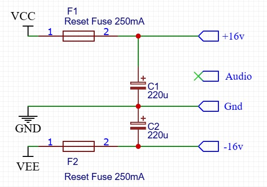
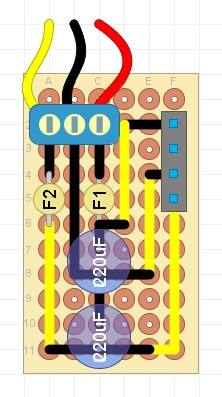

## Power Supply Module

### Purpose
This module connects an external bipolar power supply (+/-16V) to the start of the module chain.

### Schematic

### Protoboard layout

### Design Notes
- F1 / F2 (optional) - these are self resetting fuses that help protect the power supply and modules from accidental short circuits. Values around 200-250mA are recommended
- C1 / C2 (optional) - these are smoothing capacitors that help eliminate any ripple current going into the modules. 220uF electrolytics are recommended with a rating of 25V or higher.