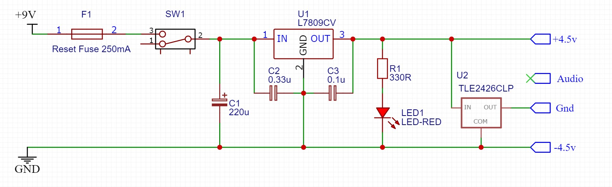
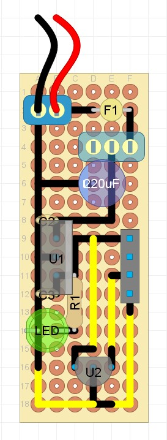

## Power Supply Module

### Purpose
This module connects an external 9v DC power supply to the start of the module chain, splitting it into dual rail +/- 4.5v.

### Schematic

### Protoboard layout

### Design Notes
- F1 (optional) - this is a self resetting fuse that helps protect the power supply and modules from accidental short circuits. Values around 200-250mA are recommended
- SW1 (optional) - turns the power on/off
- C1 (optional) - this is a smoothing capacitor that helps eliminate any ripple current going into the modules. 220uF electrolytics are recommended with a rating of 16V or higher.
- U1 / C2 / C3 (optional) - this is an L7809 9v regulator, that helps ensure that the voltage being supplied is held at a steady 9v. C2/C3 are the recommended ceramic capacitors from the L7809 datasheet, and should be placed close to the L7809 pins. This regulator is recommended when using an external power supply, as many PSUs supply a higher voltage than indicated.
- R1 / LED1 (optional) - lights when the power is switched on
- U2 - TLE2426 is a small IC that is designed to accurately split the applied voltage in half. If the voltage supplied to the input of the IC is 9v, the output will be 4.5v. By setting this +4.5v to the effective ground, this then supplies a +4.5v/Gnd/-4.5v dual rail voltage to the modules.

