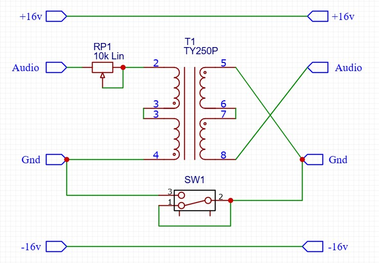

## Transformer (1:1 ratio)

### Purpose
This is a passive module that uses a single audio transformer configured in a 1:1 ratio to process the audio signal. An optional 'ground lift' switch is provided which can decouple the output ground circuit from the input

### Schematic

### Protoboard layout

### Design Notes
- T1 - the TY-250P audio transformer from Triad Magnetics is used in this example. Pin 1 is offset, so wont fit in the standard 0.1 inch board, but its unconnected. The simplest solution to mounting is to carefully remove pin 1.
- SW1 (optional) - this switch connects the ground planes of the input and output circuits. If ommitted, the ground planes should be connected.