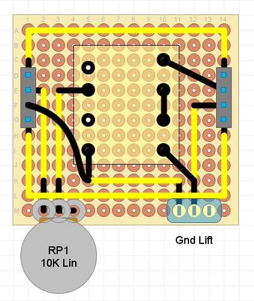

## Transformer (1:1 ratio)

### Purpose
This module uses an audio transformer configured in a 1:1 ratio to process the audio signal. An optional 'ground lift' switch is provided which can decouple the output ground circuit from the input

### Schematic

### Protoboard layout

### Design Notes
- T1 - the TY-250P audio transformer from Triad Magnetics is used in this example. Note that when soldering to a standard 0.1 inch spaced protoboard, Pin 1 is offset so it wont fit. However, as pin 1 is not connected to any coil, the simplest solutionis to just to carefully remove it e.g. with a wire cutter. This transformer can be configured as 1:2 or 1:1 ratio. In this example, the 1:1 ratio is used by connecting pins 6 & 7, and using 5 & 8 as the output.
- RP1 - the potentiometer adds additional impedance to the input transformer. This causes the transformer to saturate earlier, as well as reducing high frequency gain at higher values.
- SW1 (optional) - this switch connects the ground planes of the input and output circuits. If ommitted, the ground planes should be connected.