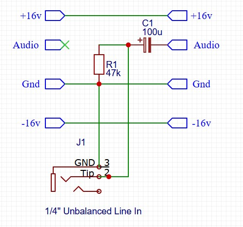
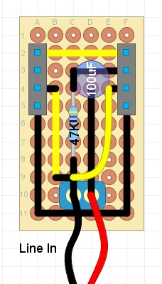

## Unbalanced Line Audio In Module

### Purpose
This module connects an external audio input (1/4 inch unbalanced jack) into the module chain. It requires a 'line level' input of 0dbu = 0.775V.

### Schematic

### Protoboard layout

### Design Notes
- R1 / C1 - act as a high pass filter, to reduce the effects of any DC offset in the input signal. The frequency is calculated using the formula f = 1 / (2 * Pi * R * C), so values for R1 and C1 can be selected to adjust for this cutoff frequency.