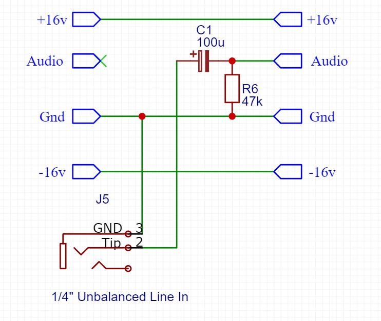

## Unbalanced Jack Audio In Module

### Purpose
This module connects an external audio input (1/4 inch unbalanced jack) into the module chain. It can be adapted to support either line level or guitar level inputs.
- For 'line level' sources (such as from a synth or audio interface), the expected level is up to 0dbu = 0.775V, and impedance around 50kOhm. R1 = 47k, and C1 = 10-100uF are suitable values.
- For input directly from a guitar, an impedance in the 1-3MOhm range is recommended. R1 = 1MOhm, and C1 = 1-3.3uF are suitable values.

### Schematic

### Protoboard layout

### Design Notes
- R1 / C1 - act as a high pass filter, to reduce the effects of any DC offset in the input signal. The frequency is calculated using the formula f = 1 / (2 * Pi * R * C), so values for R1 and C1 can be selected to adjust for this cutoff frequency. The combination of R1 & C1 should be selected to set the -3db cutoff frequency in the sub 1Hz range.