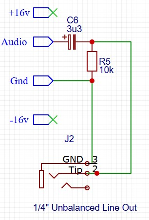
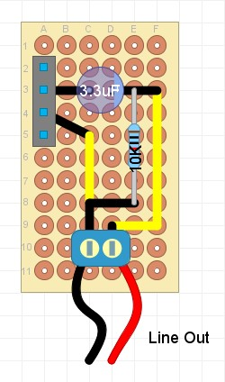

## Unbalanced Line Audio Out Module

### Purpose
This module connects an external audio output (1/4 inch unbalanced jack) to the end of the module chain. It provides 'line level' at 0dbu = 0.775V.

### Schematic

### Protoboard layout

### Design Notes
- R1 / C1 - act as a high pass filter, to reduce the effects of any DC offset earlier in the module chain. The frequency is calculated using the formula f = 1 / (2 * Pi * R * C), so values for R1 and C1 can be selected to adjust for this cutoff frequency. The example values of 3.3uF and 10kOhm give a frequency cutoff of approx 5Hz at -3db. 